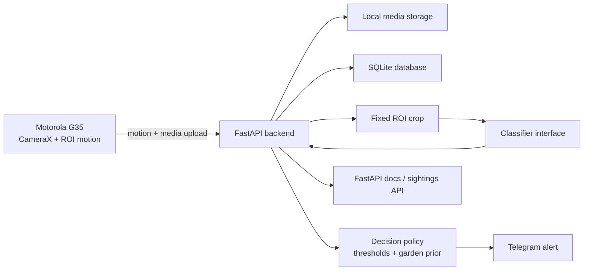

# Birdie Architecture

## Goal

Birdie uses a Motorola G35 Android phone as a fixed camera node pointed at a feeder. The phone detects motion inside a configured region of interest, captures media, and uploads each visit to a backend running on the Intel N150 mini PC.

## First Implementation Shape

## Backend Responsibilities

- Accept device status updates.
- Accept motion and media upload events.
- Store original media in a date/event directory.
- Store a cropped still image for classification and notifications when possible.
- Store sightings and predictions in SQLite.
- Run the configured classifier against the best still image.
- Convert raw predictions into a user-facing decision before alerts.
- Send a Telegram alert when notification credentials are configured, and edit the alert when a later visit candidate becomes the better frame.
- Track alert delivery time and apply the configured cooldown per device.
- Keep classifier outputs model/version tagged so old sightings can be reclassified later.

## API Surface

- `GET /health`
- `GET /config`
- `POST /device/status`
- `POST /events/motion`
- `POST /events/upload`
- `GET /sightings`
- `GET /sightings/{id}`
- `POST /sightings/{id}/reclassify`
- `GET /media/{sighting_id}/{kind}`

## Upload Metadata

- `phone_model`, `battery_level`, `temperature_c`, `network_state`, and `app_version` can be submitted during uploads or status heartbeats.
- Unknown devices are auto-registered on first upload so Android bootstrap is forgiving.
- `roi_x`, `roi_y`, `roi_width`, and `roi_height` can override the backend default ROI for a single upload.

## Classification Decision

The backend stores raw classifier output, but user-facing labels use a policy layer:

- `confident`: a common UK garden species is above the confident threshold.
- `likely`: a common UK garden species is above the likely threshold.
- `uncertain`: the model is low confidence, says `Unknown`, or predicts something outside the common garden prior without a close common alternative.

If a rare/non-garden species is the raw top prediction but a common garden species is close behind, Birdie prefers the common species as `likely`.

## Next Slices

1. Replace the dummy classifier with `birder-project/regnet_z_4g_eu-common`.
2. Add Android CameraX motion detection and upload queue.
3. Add visit grouping and duplicate alert suppression.
4. Build a proper sightings dashboard/gallery.
